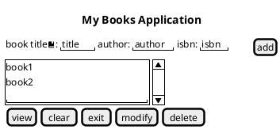

<!--
// cSpell:ignore pythonanywhere Postgre pypyodbc venv startproject asgi wsgi startapp djangorestframework psycopg2 countriesdb makemigrations sqlmigrate showmigrations serializers runserver createsuperuser name_icontains arser urlpatterns startsalt endsalt puml messagebox textvariable mainloop pady padx columnspan yview yscrollcommand sqlserver fetchall showinfo curselction askokcancel
-->

[previous](section_23_25_git_django.md)\
[main](../README.md)

## Section 26: Building an Api From Scratch

<details>
<summary>
Another Django Application. 
</summary>

### What is an API

Api Application programing interface, a set of specification for how programs interact with one another.

### Creating and activating a virtual environment

another case where we need a virtual environment.

```sh
mkdir project
python -m venv env_name
env_name\scripts\activate.sh

deactivate
```

### Installing Django and Django REST Framework

while we are inside the virtual environment.
(only works for me when i am in the windows console, not even powershell)

```sh
python -m pip install django
python -m django --version
python -m pip install djangorestframework
```

### Creating a new Django project and app

```sh
django-admin.py startproject worldCountries .
ls worldCountries
python manage.py startapp countries
ls countries
```

the project folder has:

- manage.py
- asgi.py
- settings.py
- urls.py
- wsgi.py

the app folder has

- migration folder
- python init file
- admin.py
- models.py
- tests.py
- views.py

### Register app with Django

we go to the settings.py file and we add the apps we installed to the **INSTALLED_APPS** list in the file.

we also add something to the middleware lists

### installing PostgreSQL Database Server

going to [postgresql website](https://www.postgresql.org/) and downloading the file

(or using a [docker](https://hub.docker.com/_/postgres))

we need to decide on a password and a port to use.

```sh
docker container run --name some-postgres -e POSTGRES_PASSWORD=<password> -d postgres
```

### Django and PostgreSQL Database Setup

we need the postgres installed, a running database, and the **Psycopg2** package installed. we need to configure the database setting inside the **settings.py** file of our project.

inside postgreSQL

- create new data

```sh
python -m pip instal psycopg2
```

setting.py file. before:

```py
DATABASES = {
    'default': {
        'ENGINE':'django.db.backends.sqlite',
        'NAME': os.path.join(BASE_DIR,'dn.sqlite3'),
    }
}
```

setting.py file. after:

```py
DATABASES = {
    'default': {
        'ENGINE':'django.db.backends.postgresql',
        'NAME': 'countriesdb',
        'USER': 'postgres'
        'PASSWORD': #some password
        'HOST': '127.0.0.1',
        'PORT': '5432'
    }
}
```

### Running Initial Migration

a migration is how we update the schema from the python class into the database. this can be adding a field, adding or deleting models, etc.\
A model is a class that represents a table or a collection in the database, so migrations are records of changes to the database based on changes to the python model. the migrations files are stored in the "migrations" folder of the app.

commands

- migrate - apply and un-apply migrations.
- makemigrations - create migration.
- sqlmigrate - display sql statement for the migration
- showmigrations - list project migrations and their status

```sh
venv\scripts\activate
python manage.py migrate #run migrations
python manage.py showmigrations
```

the initial migration creates the following tables:

- auth_group
- auth_group_permissions
- auth_permissions
- auth_user
- auth_user_groups
- auth_user_groups_permissions
- django_admin_log
- django_content_type
- django_migrations
- django_session

### Creating a Django Model

a model is a class that represents a table or collections.

we open the "models.py" file and create a class the derives from the Model class. we then add attributes to the class that represent sql attributes.

the primary key is added automatically and is called "Id". we also add an inner class to control the ordering for how the table is shown.

```py
from django.db import models

class Countries(models.Model):
    name = models.CharField(max_length=50, blank=False, default='')
    capital = models.CharField(max_length=50, blank=False, default='')

    class Meta:
        ordering = ("id",)
```

### Creating and Applying New Migration

we want to push the changes from the python model into the database.

```sh
python manage.py makemigrations <migration_name>
python manage.py showmigrations
python manage.py migrate <migration_name>
```

a new file is created inside the migrations folder, which defines the model and the operations on it, in this case, creating the model itself with the correct fields.

### Creating a Serializer Class

> A QuerySet represents a collection of objects from your database.\
> It can have zero, one or many **filters**. Filters narrow don the query result based on the given parameters.\
> in SQL terms, a QuerySet equates to a **SELECT** statement, and a filter is a limiting clause such as **WHERE** or **LIMIT**.

A serializer allow us to convert data from our class into a format such as json, xml or yaml files, which can be transferred over the network or stored.

we crate a "serializers.py" file in our project folder. the base class of ModelSerializer populates the field and creates validators.

```py
from rest_framework import serializers
from countries.models import Countries

class CountriesSerializers(serializers.ModelSerializer):

    class Meta:
        model=Countries
        fields = ('id','name','capital')
```

### Starting and stopping Django Development Server

django has light-weight development server that we can use to test our website.

the server has a hot-reload functionality, so if we make changes to our code, it restarts itself to include them

```py
python manage.py runserver 8080
```

### Creating a Superuser Account

each django website has an administrative zone, which we got to by going to the website url and adding '/admin' to the address line. we need to log-in with a super user, so we first create one.

```sh
python manage.py createsuperuser
#name
#email
#password
```

now we can access the administrative zone and we can view the users and permissions and eventually manage the apps attached to it.

### Creating Views

a view takes a web request and returns a response or do an action. this can mean performing an operation or returning (rendering) an html response.

django has two types of views

- function based views (FBV)
- class based view (CBV)

the views reside inside the "views.py" file.

we have some imports, and we make use of a decorator to take both the 'GET' and 'POST' requests.

```py
from django.shortcuts import render
from django.http.response import JsonResponse
from rest_framework import status
from rest_framework.decorators import api_view
from rest_framework.parsers import JSONParser

from countries.models import Countries
from countries.serializers import CountriesSerializer

@api_view(['GET','POST'])
def countries_list(request):
    if request.method == 'GET':
        countries = Countries.objects.all()

        name = request.GET.get('name',None)
        if name is not None:
            countries = countries.filter(name_icontains=name) #filter

        countries_serializer = CountriesSerializer(countries,many=True)
        return JsonResponse(countries_serializer.data, safe=False) #default status code is 200
        #safe = False for objects serialization

    elif request.method == 'POST':
        countries_data = JSONParser().parse(request)
        countries_serializer = CountriesSerializer(data = countries_data)

        if countries_serializer.is_valid():
            countries_serializer.save()
            return JsonResponse(countries_serializer.data, status=status.HTTP_201_CREATED)

        return JsonResponse(countries_serializer.errors, status=status.HTTP_400_BAD_REQUEST)

@api_view(['GET','PUT','DELETE'])
def countries_detail(request, pk): #pk is primary key
    try:
        countries = Countries.objects.get(pk=pk)
    except Countries.DoesNotExist:
        return JsonResponse({'message': "The country doesn't exist"},status=status.HTTP_404_NOT_FOUND)

    if request.method == 'GET':
        countries_serializer=CountriesSerializer(countries)
        return JsonResponse(countries_serializer.data)

    elif request.method == 'PUT':
        countries_data = JSONParser().parse(request)
        countries_serializer = CountriesSerializer(countries,data = countries_data)

        if countries_serializer.is_valid():
            countries_serializer.save()
            return JsonResponse(countries_serializer.data)

        return JsonResponse(countries_serializer.errors, status=status.HTTP_400_BAD_REQUEST)

    elif request.method == 'DELETE':
        countries.delete()
        return JsonResponse({'message': "The country was deleted successfully"},status=status.HTTP_204_NO_CONTENT)

```

### Mapping Views to URL

now that we created the views, we want to map the view functions to a url. so that accessing the URL triggers the specified view.

| Url                 | Method         | View function          |
| ------------------- | -------------- | ---------------------- |
| "/api/countries"    | GET,POST       | views.countries_list   |
| "/api/countries/id" | GET,PUT,DELETE | views.countries.detail |
| "/admin"            | GET            | admin.site.urls        |

this is done in the url configuration file "urls.py"

here we use some regex, the `r` prefix to the string means we use a raw-string, so we won't take into account python escape characters and so on. (so we don't need to escape the slashes)

- `^` - start of line
- `$` - end of line
- `+` - one or more of the previous token
- `[0-9]` - match any digit, similar to `\d`
- `(?P<pk>)` - capture group named pk

```py
from .django.urls import path
from countries import views

urlpatterns = [
    url(r'^api/countries$',views.countries_list),
    url(r'^api/countries/(?P<pk>[0-9]+)$',views.countries_detail),
]
```

we need to match the project urls to the the app urls, so we go to the main "urls.py" file.

```py
from django.contrib import admin
from django.urls import path
from django.conf.urls import url, include

urlpatterns= [
    path('admin/', admin.site.urls),
    url(r'^',include('countries.urls'))
]
```

### Register Model with Admin Site

```sh
python manage.py runserver
```

we go to the site, enter the user name and account.

and now we want to register the countries model.

inside the apps "admin.py" file

```py
from django.contrib import admin
from .models import Countries

admin.site.register(Countries)
```

we will see the changes in the admin site, and now we see the model.

### Creating Model Objects

model objects are records in the table, so from the admin zone,we can press 'add' to add a country. we get some fields to fill up with records. the name of the countries aren't showing so we need to update our model class with the string representation function.

```py
from django.db import models

class Countries(models.Model):
    name = models.CharField(max_length=50, blank=False, default='')
    capital = models.CharField(max_length=50, blank=False, default='')

    def __str__(self):
        return self.name

    class Meta:
        ordering = ("id",)
```

now we see the countries and not just 'object(1)', we can edit each object and see the history of each record.

### Testing API with Postman

[Postman](www.postman.com) is an api client that allows to send API requests, we can use it to experiment and test our apis. we can save our requests, share them and so on.

to create a country, we add a url, choose the POST method, and switch to the "Body" tab, choose "Json" and insert the object to the body.

```json
{
  "name": "Denmark",
  "capital": "Copenhagen"
}
```

we can do Get for all objects, get a country by id, update the data with PUT or remove it with the DELETE method.

</details>

## Section 27: Creating A Crud App

<details>
<summary>
a simple application that lists records of books and interacts with a database.
</summary>

### What is CRUD

CRUD - create, read, update, delete.\
the four basic operations that we perform on a database. creating records, reading them, updating them and removing them.

we will have python application that interacts with the database.

### Application Design and Sketch

a mockup of how the app will look:

- fields for input
- a button to add
- listbox area of all the records
- buttons:
  - view
  - clear
  - exit
  - modify
  - delete



### Creating app GUI:

we start with the gui side of our code. we go back to the Tkinter module with the widgets

the most basic way to start is to create a Tk object and start running.

```py
from tkinter import Tk

root = Tk()
root.mainloop()
```

next we want to add a title to the application window, add background color and define a set size for it and stop the user from changing the size

```py
root = Tk()
root.title("app title!")
root.configure(background="light green") #bg
root.geometry("850x500")
root.resizable(width=False,height=False)
root.mainloop()
```

next we want to add the Labels in the correct places according to the grid, add the variables to store user inputs, and add the Entry widgets that the user writes to.

```py
title_label =ttk.Label(root, text="Title", background="light green", font = ("TKDfaultFont",16))
title_label.grid(row=0, column=0, sticky=tkinter.W)
title_text = StringVar()
title_entry =ttk.Entry(root, width=24, textvariable=title_text)
title_entry.grid(row=0, column=1,stick=W)
```

now we add buttons, a list box with a scroll bar and we set them on the window grid.

```py
#button
add_btn = Button(root, text="Add Book", bg="blue", fg="white",font="helvetica 10 bold", command="")
add_btn.grid(row=0, column=6, sticky=W)

#listbox
list_box = Listbox(root, height=16,width=40,font="helvetica 13",bg="light blue")
list_box.grid(row=3,column=1,columnspan=14,sticky=W+E, pady=40,padx=15)

scroll_bar = Scrollbar(root)
scroll_bar.grid(row=1,column=8,rowspan=14, sticky=W)
list_box.configure(yscrollcommand=scroll_bar.set)
scroll_bar.configure(command=list_box.yview)
```

we'll add more buttons now, they still don't have any actions attached to them.

- modify record
- delete record
- clear screen
- exit program
- view all

### What is SQL Server

SQL-server is a relational database management system by microsoft. it can be run on a dedicated machine or locally.

it uses a special flavour of sql called transactional-sql, or T-SQL

[dockerHub sql](https://hub.docker.com/_/mysql), [dockerHub admirer](https://hub.docker.com/_/adminer)

### SQL Server Editions

- enterprise
- standard
- web
- developer
- express

SSMS- sql server management studio, an IDE for connecting a working with the sql server.

(i will use the admirer container instead)

**(for the future, i'll need to create the environment variables files:
MYSQL_ROOT_PASSWORD:
MYSQL_DATABASE: books
)**

### Creating a Database and Table

after we managed to get the sql server running an we are connected to it via the UI, we can create the database and the tables.

we will use the SSMS

```sql
CREATE DATABASE books_db;

USE books_db;
-- CREATE TABLE books(id int PRIMARY KEY IDENTITY(1,1),Title VARCHAR(255), Author VARCHAR(255),ISBN int);
CREATE TABLE books(id int PRIMARY KEY NOT NULL AUTO_INCREMENT ,Title VARCHAR(255), Author VARCHAR(255),ISBN int);
```

### Creating a Database Configuration File

we want a configuration file to connect to the database.

- driver
- server
- database
- username
- password

we keep those in a different file, and we import them as a module.

so we create a python file "sqlserver-config.py" (not in repository)

```py
dbConfig= {
    'driver': 'SQL Server',
    'server':'',
    'Database':'books_db',
    'username':'root',
    'password': #update
}
```

### Create a virtual environment and install pypyodbc

we create a virtual environment and install the **pypyodbc** module. this module interacts with databases.

```sh
python -m venv venv
venv\scripts\activate
python -m pip install pypyodbc
```

### Connect Python File to Database

we first import our configuration file into the python file

```py
from sql_config import dbConfig
import pypyodbc as pyo

con = pypyodbc.connect(**dbConfig) #pass all contents as parameters
print(con)
```

### Create a Cursor Object

a cursor object is an object that interacts with the sql database and executes commands. we create it from the pypyodbc connection object, with the `.cursor()` method. the cursor is bound to the database connection and the session.

```py
con = pypyodbc.connect(**dbConfig) #pass all contents as parameters
print(con)
cursor = con.cursor()
```

### Create a Class and Methods

we define a class with a constructor and destructor and other methods (the CRUD operations):

- view
- insert
- update
- delete

```py
class BooksDb:
    def __init__(self):
        self.con = pypyodbc.connect(**dbConfig)
        self.cursor = con.cursor()
        print("You have connected to the database")
        print(con)

    def __del__(self): #destructor
        self.con.close()

    def view(self):
        self.cursor.execute("SELECT * FROM books")
        rows = self.cursor.fetchall()
        return rows

    def insert(self, title, author, isbn):
        sql = ("INSERT INTO books(title, author, isbn) VALUES (?,?,?)")
        values=[title, author, isbn]
        self.cursor.execute(sql, values)
        self.con.commit()
        messagebox.showinfo(title="Books Database", message = "New book added to database")

    def update(self,id, title, author, isbn):
        sql = ("UPDATE books SET title = ? , author = ?, isbn = ? WHERE id = ?")
        values=[id,title, author, isbn]
        self.cursor.execute(sql, values)
        self.con.commit()
        messagebox.showinfo(title="Books Database", message = "Book updated")

    def delete(self, id):
        sql = ("DELETE FROM books WHERE id = ?")
        values=[id]
        self.cursor.execute(sql, values)
        self.con.commit()
        messagebox.showinfo(title="Books Database", message = "Book deleted")
```

### Create function for selected row

capturing the selection row event, this will happen outside the class.

```py
db = BooksDb()

def get_selected_row(event):
    global selected_tuple # reference a global variable
    index = list_bx.curselction()[0]
    selected_tuple = list_bx.get(index)
    title_entry.delete(0,'end') #clear
    title_entry.insert('end',selected_tuple[1]) #populate
    author_entry.delete(0,'end') #clear
    author_entry.insert('end',selected_tuple[2]) #populate
    isbn_entry.delete(0,'end') #clear
    isbn_entry.insert('end',selected_tuple[3]) #populate
```

### Interacting Function

- view_records
- add_book
- delete_records
- clear_screen
- update_records
- on_closing

```py
def view_records():
    list_bx.delete(0,'end')
    for row in db.view():
        list_bx.insert('end',row)

def add_book():
    db.insert(title_text.get(), author_text.get(), isbn_text.get())
    list_bx.delete(0,'end')
    list_bx.insert('end',(title_text.get(), author_text.get(), isbn_text.get()))
    title_entry.delete(0,'end')
    author_entry.delete(0,'end')
    isbn_entry.delete(0,'end')
    con.commit()

def delete_records():
    db.delete(selected_tuple[0])
    con.commit()

def clear_screen():
    list_bx.delete(0,'end')
    title_entry.delete(0,'end')
    author_entry.delete(0,'end')
    isbn_entry.delete(0,'end')

def update_records():
    db.update(selected_tuple[0],title_text.get(), author_text.get(),isbn_text.get())
    title_entry.delete(0,'end')
    author_entry.delete(0,'end')
    isbn_entry.delete(0,'end')
    con.commit()

def on_closing():
    dd= db
    if messagebox.askokcancel("Quit", "Do you want to quit?"):
        root.destroy()
        del dd

```

### Activate Button Widgets

wiring, connecting the actions to the buttons. we search for the places where we created the button, and we replace the empty string commands with the function.

```py
btn = tkinter.Button(app,
                        text="btn text",
                        bg="blue",
                        fg="white",
                        font="helvetica 10 bold",
                        command=action) #replace action with the function
```

we also need to connect the list box and bind it to the selection method

```py
list_bx.bind('<<ListboxSelect>>',get_selected_row) #event, function
```

### App and Database Interaction

interaction between the database and the python program.

**I Couldn't get this to work**

</details>

[next](section_28_29_data_science_machine_learning.md)
